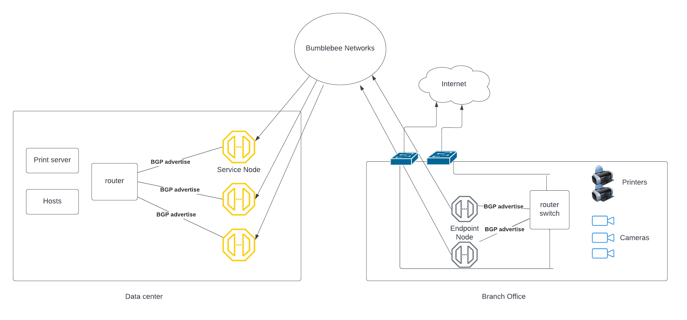

=====================================
Create App Service in network mode
=====================================

When to create App Service in network mode?
===============================================

Bumblebee Global Private Link builds connectivity without the need for routing, this works perfectly 
for B2B networking for on-prem to on-prem, cross region and multi-cloud. 
But there are situations where dynamic network routing is preferred. 
For example, a print server is located in head quarter and printers are in branch offices. 
Print server initiated traffic needs to reach many printers and many branches. 
If using private link technique, one will need to build many app services. For such scenarios, network node is a better solution. 

In network mode, App Services act as the concentrator side and Endpoints act as branch side, both sides performs routing functions.  
Traffic can be initiated from both app service side and endpoint side, and the solution is cloud scale. 
To have the ability of dynamic fail over, BGP routing should be enabled on both endpoint and app service run BGP sessions to exchange routes. 
This BGP routing enables dynamic failover if one app service or endpoint fails. 

|network_mode|

In the diagram above, a branch office deploys 2 Endpoint nodes and in the head office 3 App Service nodes are deployed. Print servers in the head office can initiate print commands to the printers located in the branch offices. 

Key features
================

Both Endpoint side of the network and App Service side of the network can initiate traffic.
App Service nodes and Endpoint nodes have no public IP address associated with them. No inbound firewall ports need to be opened. 
Support static routing and dynamic routing using BGP. 
Support network address translation for overlapping network address ranges between the endpoint network side and app service side and between endpoints themselves. 
Support scale out deployment where clusters of Endpoint nodes and App Service nodes can be deployed to increase network throughput. 
Support dynamic failover of multiple endpoint nodes and app service nodes. 

Configuration steps
=======================

1. Log in to the platform console
#. At the left navigation bar, click App Services
#. Click + Create App Service
#. Enter the App Service name (you can change it later)
#. For Location, select Network
#. For the Real subnet CIDRs, enter the network address range of the network where App Service is deployed. Example, 192.168.1.0/24
#. Select Enable address translation if there are any overlapping network CIDRs in the network. 
    - if Enable address translation is selected, a virtual address range is popped up, this is the default range recommended by Bumblebee platform. You can overwrite if you wish to customize. 
#. Select Enable BGP if App Service advertise routes to the router connects to the Service nodes. 
#. If Enable BGP is selected
    - Enter what you wish the Bumblebee side ASN number be, for example 65001
    - Enter what your router ASN number be, for example 65002
    - Enter your router side BGP peer IP address (Bumblebee side peer IP address will be displayed at the App Service Details page as the field BGP local IP)
#. Select a Service Node group in the drop menu. If there is no Service Node gorup, follow the instructions list here, to create one and then return to the current page and select a Service Node Group in the drop down menu.
#. Click Create.
#. Once the App Service is created, an App Service ID is generated. The App Service ID is what your partners or customers use to make a request to connect to your application. 
    .. note::
         When App Service is configured in network node, all Endpoints must all be in Network mode. 

#. For a complete end-to-end configuration workflow, check out Tutorial: end-to-end-configuration.  

