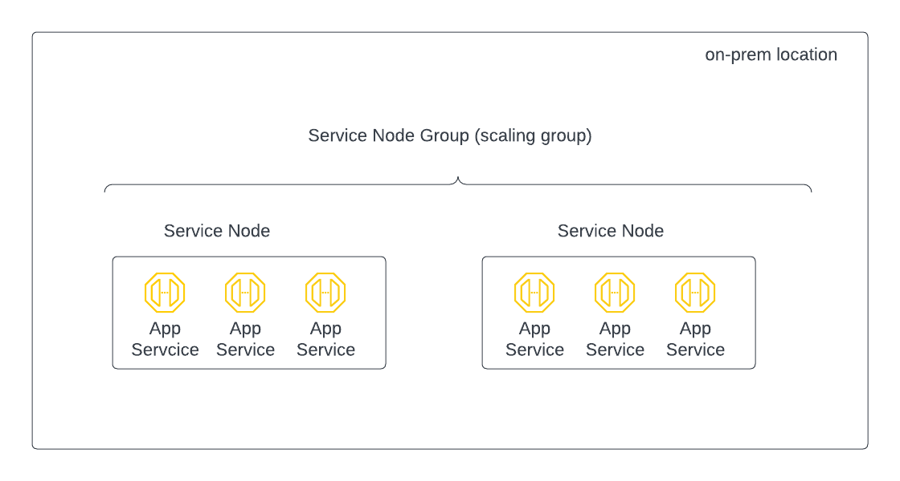

==============================================
Scaling App Service
==============================================

Scaling on-prem or Network Mode App Service
===============================

on-prem or Network Mode App Service scaling is by deploying more service nodes in the same Service Node Group. 

|service_node_group|

An on-prem App Service is always created in a Service Node Group. To improve the throughput of the App Service, 
create a new Service Node in the same group. Bumblebee Networks automatically 
installs App Services in the new Service Node. Endpoints' incoming traffic is 
spread among all Service Node. By default the platform supports up to 6 Service Nodes in one location. 
Contact support@bumblebeenet.com if you need to install more service nodes. 

Scaling up on-prem App Service
---------------------------------

Add a service node to increase performance for on-prem App Service
To create a new Service Node in the existing Service Node group, follow the instructions below. 

1. Login to the Bumblebee Portal
#. Click Service Nodes at the main navigation menu
#. Click Create New Service Node
#. Enter a Service Node name
#. For Service Node Group, select Use Existing
#. In the drop down menu select one existing group
#. Click Create Service Node
#. Click Prepare OVA for download
#. Click Download
#. Install the OVA on your on-prem datacenter or office where previous nodes are also deployed
#. Boot up the OVA
#. Go back the Bumblebee Networks console, you should see the new node is registered and in up state. 
#. Done

Scaling down on-prem App Service
----------------------------------

Scaling down on-prem App Service is by deleting a Service Node in the Service Node group. 

1. Login to the Bumblebee portal
#. Click Service Nodes at the main navigation menu
#. Select the service node you like to delete, click Actions
#. Click Delete. 
#. Done

Troubleshooting Tips
------------------------

If the new node does not come up, follow the instruction here to troubleshoot. 

Scaling cloud App Service
============================

Cloud App Services, such as AWS App Service where application is deployed in AWS or Azure App Service where application 
is deployed in Azure, can be scaled up or down. The steps are as follows. 

1. Login to the Bumblebee portal
#. Click App Services at the main navigation menu
#. Select an App Service, click Actions
#. Click Resize App Service
#. Size up by 1 unit or Size down down by 1 unit
#. Click confirm

