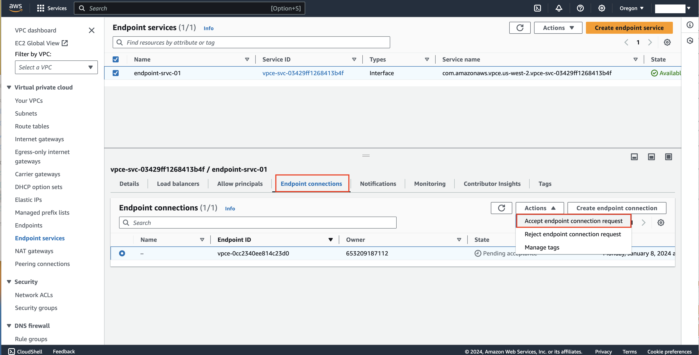

====================================================
Accept connection request in AWS
====================================================

After you create an App Service AWS application, you will see a pending connection request from 
Bumblebee Networks on your AWS console. To complete the setup, you need to accept connection request 
from Bumblebee Networks. Follow the instructions below to complete the steps. 

1. Login in AWS console, go to VPC page. Click Endpoint Services at the left navigation menu. 
#. Select the endpoint service you have created that granted access (Allowed Principals)  from Bumblebee Networks. 
#. Click Endpoint connections tab. 
#. Select the connection request from account owner 653209187112 (this is the Bumblebee Networks account). From the Actions drop down menu, click Accept endpoint connection request as shown in the screenshot below. 

|accept_connection_request|

