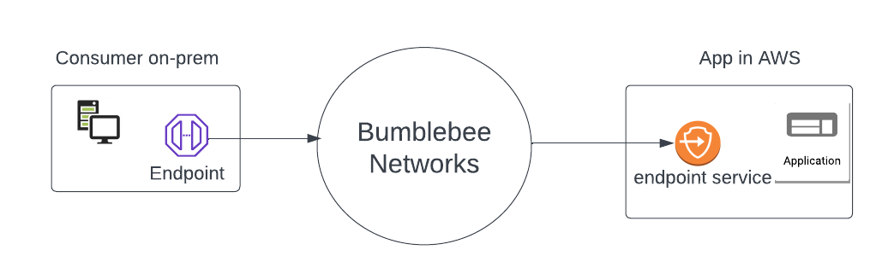
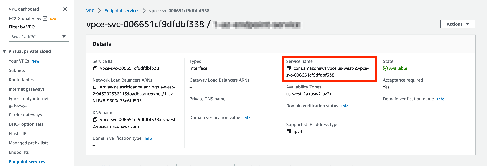

=========================================================
Create App Service for AWS Application
=========================================================

This document shows you how to create a Bumblebee Networks App Service for applications in AWS. 

To create an App Service for an on-prem application, follow the instructions `here <https://bumblebee-networks-bumblebee-docs.readthedocs-hosted.com/en/latest/AppService/create_app_service_onprem.html>`_.

Prerequisite Steps
===================================================

1. **Setup AWS endpoint service**. The mechanism of connecting consumers of Bumblebee Network platform to applications in AWS is to use the native AWS endpoint service as the intermediary of your application, as shown below. You need to front end your application with an AWS endpoint service. Click to learn on how to `Configure an AWS endpoint service. <https://docs.aws.amazon.com/vpc/latest/privatelink/configure-endpoint-service.html>`_
#. **Grant access from Bumblebee Networks**. Grant access to Bumblebee Networks to connect to the AWS endpoint service by following the instruction here. 

|cloud-app|

Configuration Steps
================================

Once you have your AWS endpoint service setup and grant access from Bumblebee Networks for the application, follow the steps below. 

1. Login to Bumblebee platform console

#. At the left navigation menu, click App Services

#.  Click + Create App Service

#. Enter the App Service name (you can change it later) 

#. For Location, select AWS

#. For Protocol, only TCP is supported

#. For Port, enter a single port number. The format is, for example, 80, or 443

#. Select an AWS region in the drop down menu. 

#. For AWS Endpoint Service Name field, copy and paste the text for Service Name created in the prerequisite step 1 in AWS console as shown below.

|copy_service_name|

#. Click Create. 

#. Wait for the Admin State of the just created App Service to go into "pending". Then Go to AWS console VPC -> Endpoint Services and approve the connection request from Bumblebee Networks (select the connection request from owner 653209187112, click Accept endpoint connection request from Action drop down). For complete instructions, read How to accept connection request in AWS from Bumblebee Networks. 

#. Once step 12 is completed, copy the App Service ID and securely distribute it to your partners and customers who wish to connect to your application in the cloud. Each customer will need your approval on the Bumblebee Networks platform for access. See Tutorial: end-to-end configuration workflow for more details.  

