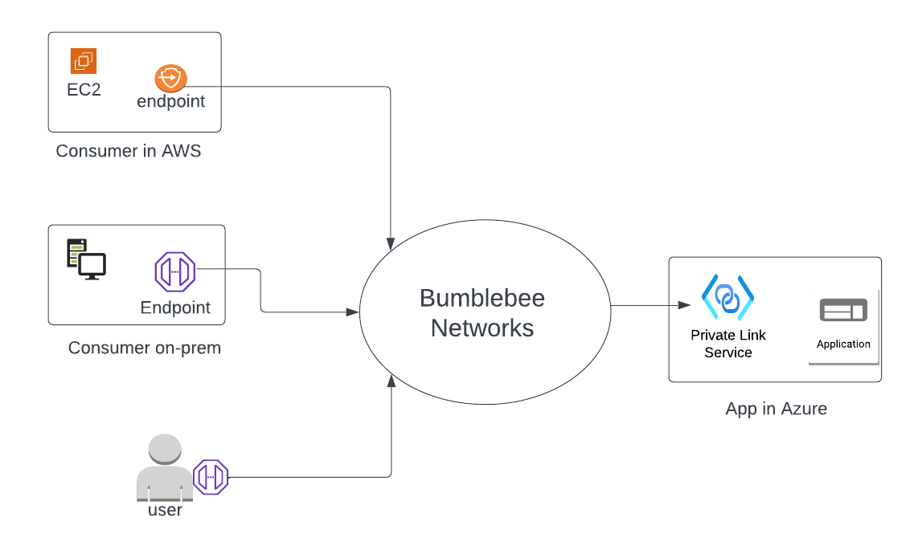
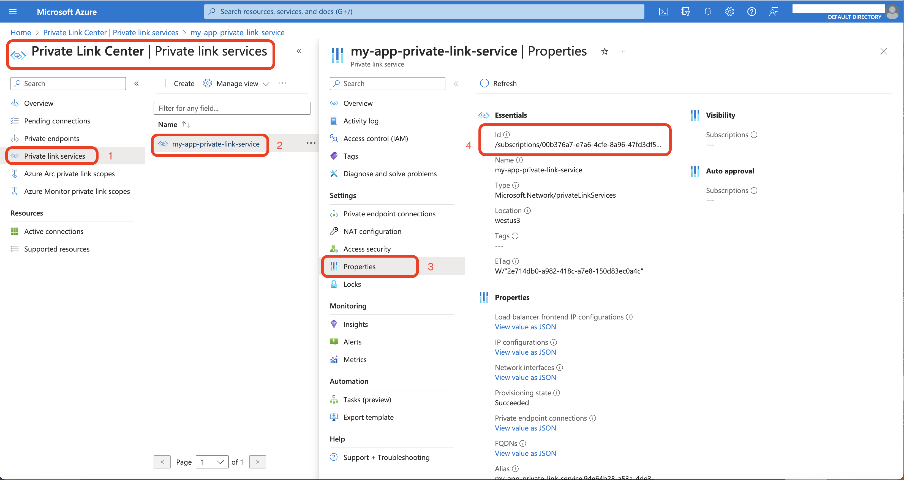
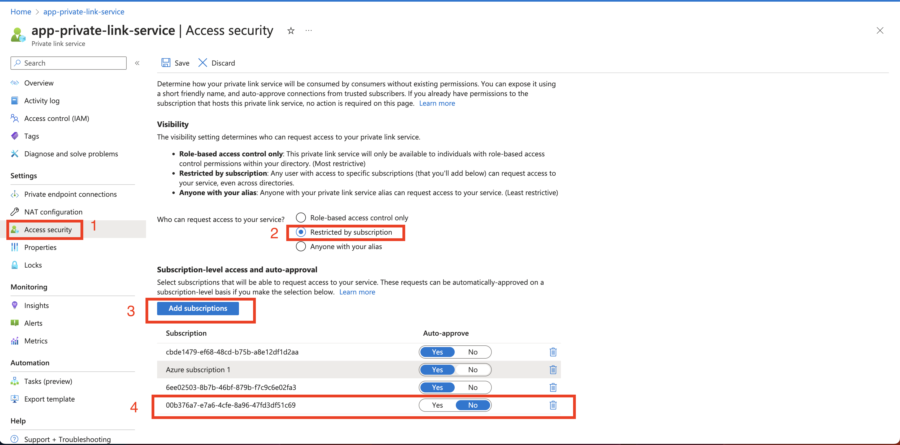
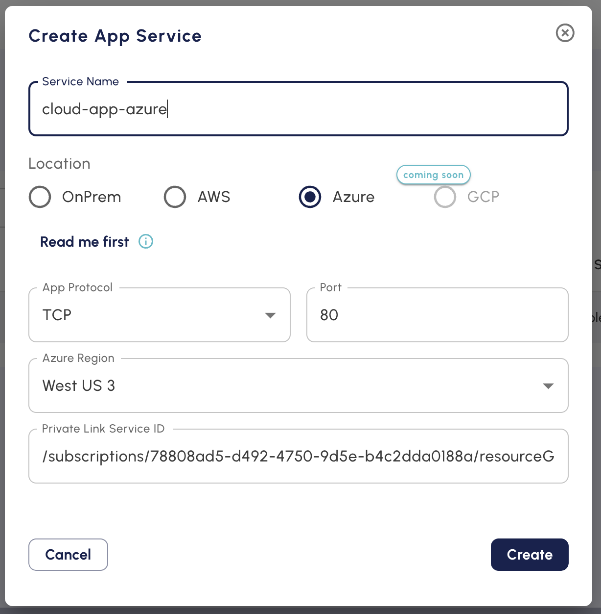

==========================================================
Create App Service for Azure application 
==========================================================

This document shows you how to create an app service for applications deployed in Azure.

(To create an App Service for an on-prem application, follow the instructions `here <https://bumblebee-networks-bumblebee-docs.readthedocs-hosted.com/en/latest/AppService/create_app_service_onprem.html>`_)

(To create an App Service for an application in AWS, follow the instructions `here <https://bumblebee-networks-bumblebee-docs.readthedocs-hosted.com/en/latest/AppService/create_app_service_aws.html>`_)

The mechanism for connecting consumers to applications in Azure is to use the native Azure private link service as the front end of your application, as shown below. Click to learn how to configure azure private link service. 

|azure_app|

Once you have Azure private link service setup for your application, follow the steps below.

1. Login to the Bumblebee platform console

#. At the left navigation bar, click App Services

#.  Click + Create App Service

#. Enter the App Service name (you can change it later)

#. For Location, select Azure

#. For Protocol, select TCP or UDP

#. For Port, enter a port number. The format is, for example, 80, or 443

#. For Azure Region, select one where your application is deployed in the drop down menu. (If you don't see the region where your application is deployed, contact us at  support@bumblebeenet.com)

#. For Azure private link resource ID field, it can be found on the Azure portal as shown in the screenshot below. (Steps: At Azure portal, click Private Link, click Private link services, then click the private link service for the application. Click Properties, the id string is the resource ID). Copy and paste the Azure private link resource ID.

    |azure_private_link_service|

#. Allow application in Azure to accept connection request from Bumblebee Networks. At Azure Home portal 

    a. Click Private Link, 
    #. Click Private Link Services, 
    #. Click the private link service you wish to grant Bumblebee Networks for access. 
    #. Click Access security.
    #. Select Restricted by selection at the question Who can request access to your service. 
    #. Click Add subscriptions
    #. In the pop up page, enter Bumblebee Networks subscription ID: **00b376a7-e7a6-4cfe-8a96-47fd3df51c69**
    #. Enter OK.
    #. Go back to private link service page, Click Save. 

    As shown blew. Note if you enable Auto-approve, you do not need Step 12 in the following section. 

    |allow_bumblebee_subscription|

#. Back to Bumblebee Networks console, click Create. Below is an example to create an app service in Azure where the application is deployed in "West US 3" and its private link service ID is /subscriptions/78808ad5-d492-4750-9d5e-b4c2dda0188a/resourceGroups/APP1-RG/providers/Microsoft.Network/privateLinkServices/app-private-link-service

    |app_service_azure|

#. If you did not enable Auto-approve of Bumblebee Networks' subscription, once the app service is created, there should be a connection request pending from Bumblebee Networks to this private link service. Grant access to Bumblebee Networks to connect to your Azure private link service by following the instructions here. 

#. Once the App Service is created, copy the App Service ID and distribute it to your partners and customers who wish to connect to your application in the cloud. Each customer will need your approval on the Bumblebee Networks platform for access. See Tutorial: end-to-end configuration workflow for more details.  

