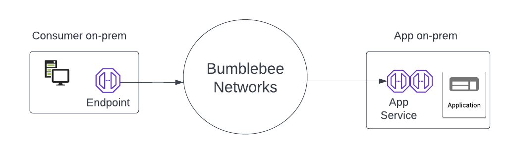

======================================================
Create App Service for on-prem application
======================================================

This document shows you how to create an App Service for on-prem application. 

App Service is a construct and is deployed on the service provider side when its applications are accessed from 
consumers as shown in the diagram below. 

|on-prem-app|

follow the steps below to create an App Service:

1. Log in to the platform console

#. At the left navigation bar, click App Services

#. Click + Create App Service

#. Enter the App Service name (you can change it later) 

#. For Location, select on-prem (For Network mode, check out this article.)

#. For Protocol, select TCP or UDP

#. For Port, enter a port or a port range. The format is, for example, 80, or 443:444. Multiple ranges with comma separations are accepted. For example, 443:444, 500:501

#. For App on-prem DNS Name or IP, enter the local DNS name for the application if there is one. This local DNS name is for the App Service to reach the application to forward connection requests or packets to the application. 

#. If you are creating the very first App Service in an on-premise location, the Service Node Group should be empty. Click New Group to create one. Service Node Group is a scaling 
group where multiple Service Nodes for the same App Service ID can be load balanced for higher performance. 

#. Once a Service Node is created following the instructions list here, return to the current page and select a Service Node Group in the drop down menu. 

#. Click Create.

#. Once the App Service is created, an App Service ID is generated. The App Service ID is what your partners or customers use to make a request to connect to your application. 

#. For a complete end-to-end configuration workflow, check out Tutorial: end-to-end-configuration.  

