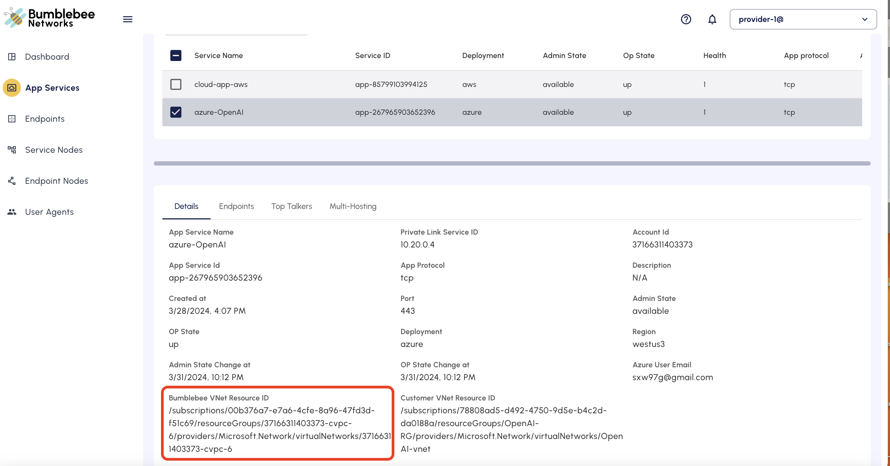

=================================================
Create App Service for Azure OpenAI
=================================================

This document shows you how to create an App Service for Azure OpenAI so that you can 
connect to Azure OpenAI privately from AWS, on-prem or remote developers. 
To learn the benefits of using Bumblebee Networks solution to connect to Azure OpenAI, 
check out this white paper. 

Creating an App Service for Azure OpenAI is slightly different from the 
`standard App Service for Azure  <https://bumblebee-networks-bumblebee-docs.readthedocs-hosted.com/en/latest/AppService/create_app_service_azure.html>`_
on the Bumblebee platform due to the fact that Azure OpenAI is a managed service 
(this article applies to all Azure managed service) to which the only way to access 
privately is through Azure OpenAI private endpoint exposed and managed by Azure. 

This document assumes you have already created a private endpoint and Azure OpenAI. 
If you need assistance, `this article <https://learn.microsoft.com/en-us/azure/ai-services/openai/how-to/create-resource?pivots=web-portal>`_ 
provides a step by step instructions. 
Remember to select Option 3: Disable network access when 
Configuring Network Security and proceed to create Private Endpoint. 
(It is not necessary to enable private DNS on Azure portal, 
as it is meant for  accessing from Azure VNet to the OpenAI private endpoint)

There are two parts in creating an App Service for Azure OpenAI: 
part I is to create an App Service on Bumblebee portal, 
part II is to create an VNet peering with VNet belonged to Bumblebee Networks. 

|app_service_openai|

Part I: Create App Service for Azure OpenAI 
=================================================

1. Login to the Bumblebee platform console
#. At the left navigation bar, click App Services
#. Click + Create App Service
#. Enter the App Service name (you can change it later)
#. For Location field, select Azure
#. For Protocol, select TCP
#. For Port, enter a port number 443 (OpenAI API endpoints operates on HTTPS 443)
#. For Azure Region, select the one where your OpenAI instance is deployed in the drop down menu. (If you don't see the region where your application is deployed, contact us at support@bumblebeenet.com)
#. For OpenAI Private Link field, select Yes
#. For Private Endpoint IP Address field, enter the OpenAI private endpoint IP address. 
    You can find this information on the Azure portal: 
        1) at the Virtual Network page, select the VNet where you created OpenAI, 
        2) on the left navigation panel, click Private endpoints. 
        3) Select the private endpoint for the OpenAI, 
        4) at the Overview page click Network Interface field it should display the page where Private IPv4 address displays Private IPv4 address (something like 10.20.0.4)
#. For Remote VNet Resource ID, login to your Azure portal, navigate to Virtual Networks, select the vnet where you deployed your OpenAI instance. Click Properties, copy the Resource ID. (The format of Resource ID looks something like this: /subscriptions/78808ad5-d492-4750-9d5e-b4c2dda0188a/resourceGroups/OpenAI-RG/providers/Microsoft.Network/virtualNetworks/OpenAI-vnet)
#. For Customer User Email field, enter the user email for your Azure account where you have deployed OpenAI instance. The user associated with the email will be invited as a guest to join the Bumblebee Azure account. 
#. Accept Invitation. It takes a few minutes for Bumblebee Networks to create the infrastructure and complete this part. When the process is completed, the user whose email has been entered in creating the app service should receive an email from Microsoft inviting the user to join Bumblebee Networks' Azure account as guest.
#. On the Bumblebee portal, the app service Admin State should become "available". The Op State should still be in "down" state because the configuration is not complete. 

Part II: Build VNet peering to Bumblebee Networks VNet
==========================================================

This part is to build a VNet peering from the VNet in your account where OpenAI instance is deployed to Bumblebee Networks. 
VNet peering is how Azure OpenAI allows different Azure tenants to access the OpenAI and 
in this case, the third party tenants is the Bumblebee Networks. 

1. Before you create an VNet peering to Bumblebee Network VNet, you need to invite an Bumblebee user account to 
join your Azure EntraID as a guest with a Network Contributor role. 
The guest user is sxw@bumblebeenet.com
 
Follow the instructions here to invite sxw@bumblebeenet.com as a guest. 

#. Find out Bumblebee VNet Resource ID. This field can be found on the Details page of the App Service you created in Step 1. 

|vnet_resource_id|

#. Follow the `Azure instructions <https://learn.microsoft.com/en-us/azure/virtual-network/create-peering-different-subscriptions?tabs=create-peering-portal#create-peering-connection---vnet-1-to-vnet-2>`_  
to create a VNet peering from the VNet where you install OpenAI to 
the Bumblebee VNet Resource ID you noted in the previous step, 
as shown in the example below, where for the Directory field, 
select in the drop down the Bumblebee guest domain name: Default Directory (sxwbumblebeenet.onmicrosoft.com). 
Click Authenticate and authenticate using your own Azure account login. 

    |vnet_peering|

4. Test connection. The Op State of the app service should be "up" state. To test connectivity, select the App Service, 
click Actions -> Test Reachability. 
The test results should show the state of the App Service and the round trip time (rtt in miniseconds).

Create Endpoints
====================

Once the App Service is created, you can follow the instructions here to create endpoints to 
connect to the Azure OpenAI. 

