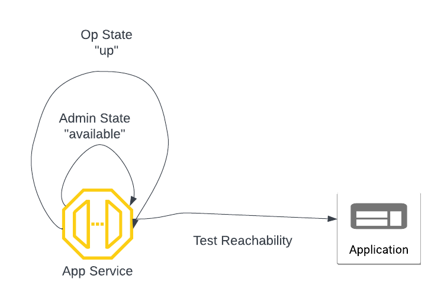

===============================
Troubleshoot App Service
===============================
This document shows you how to troubleshoot an app service connectivity issues. 

|troubleshoot_app_service|

Step 1 Check Admin State
==================================================================

Login to the Bumblebee Networks platform. Click App Services at the navigation bar, you should see a list of the App Services. 

For the App Service you wish to troubleshoot, make sure its Admin State is "available". If Admin State is "starting", wait for a few minutes for it to change. If Admin State appears to be stuck in "starting" after 10 or more minutes, delete the App Service and create it again. 

Step 2. Check Op State
========================

For the App Service under investigation, make sure its Op State is "up". 

Step 3. Run Reachability Test
=================================

On the App Service page, select the App Service under investigation, click Test Reachability under Actions drop down menu. The Test Reachability returns the state of connectivity and round trip delay (RTT) from the App Service to the application it represents. 

Step 4. Contact support
==========================

Email support@bumblebeenet.com if you need additional help. 

