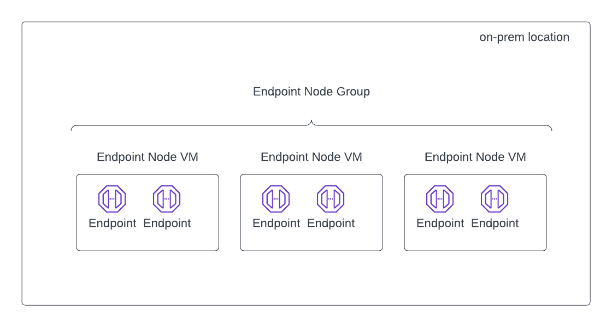

==========================================================
Create Endpoint Node and Endpoint Node Group
==========================================================

On Bumblebee Networks, an Endpoint Node is a virtual machine that hosts Endpoint when it is deployed on-prem in a data center or office. One Endpoint Node can host multiple Endpoints.

An Endpoint Node Group represents a group of Endpoint Nodes in one on-premise location.  
The Endpoints for the same App Service but are hosted on different Endpoint Nodes in the same Endpoint Node group form a scaling group. 
This scaling group load balances traffic initiated from devices in the on-premise network. 
The relationship between Endpoint, Endpoint Node and Endpoint Node Group is described in the diagram below. 

|endpoint_node|

The Endpoint Node virtual machine is downloaded in a OVA file format and you can use vCenter or vSphere Host Client to launch. 

To download an Endpoint Node, login to Bumblebee Networks platform. 

1. Click Endpoint Nodes on the main navigation menu, then click Create Endpoint Node. A pop up window should appear. Enter a name for the Endpoint Node, and read the text below for Endpoint Node Group. 
#. Click New Group to enter a new group name or click Use Existing to select an already created Node Group. 
#. Click Create Endpoint Node. 
#. Click Preparing for OVA for Download
#. Click Download OVA. 
#. The OVA is built to work with Intel based servers. For help deploying OVA, follow the instructions here. 
#. Make sure DHCP is enabled on the subnet OVA is deployed. Once the virtual machine is installed and started, it should automatically registers with the Bumblebee platform.
#. Login to the Bumblebee platform, you should see the Endpoint Node is registered. The Admin State for the Endpoint Node should be in "registered" state and the Op State should be in "up" state. 

