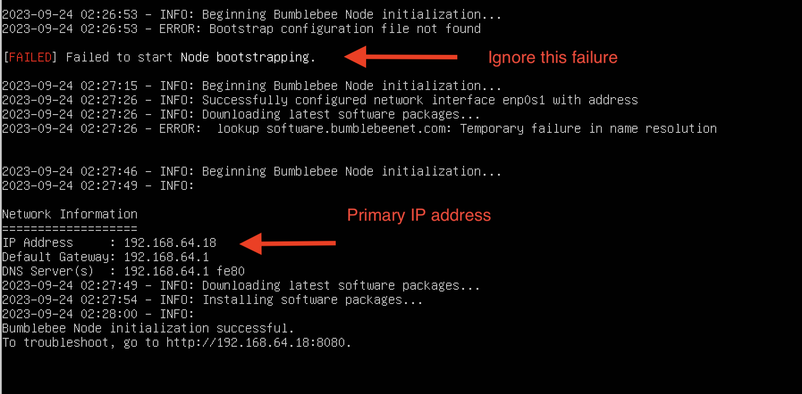
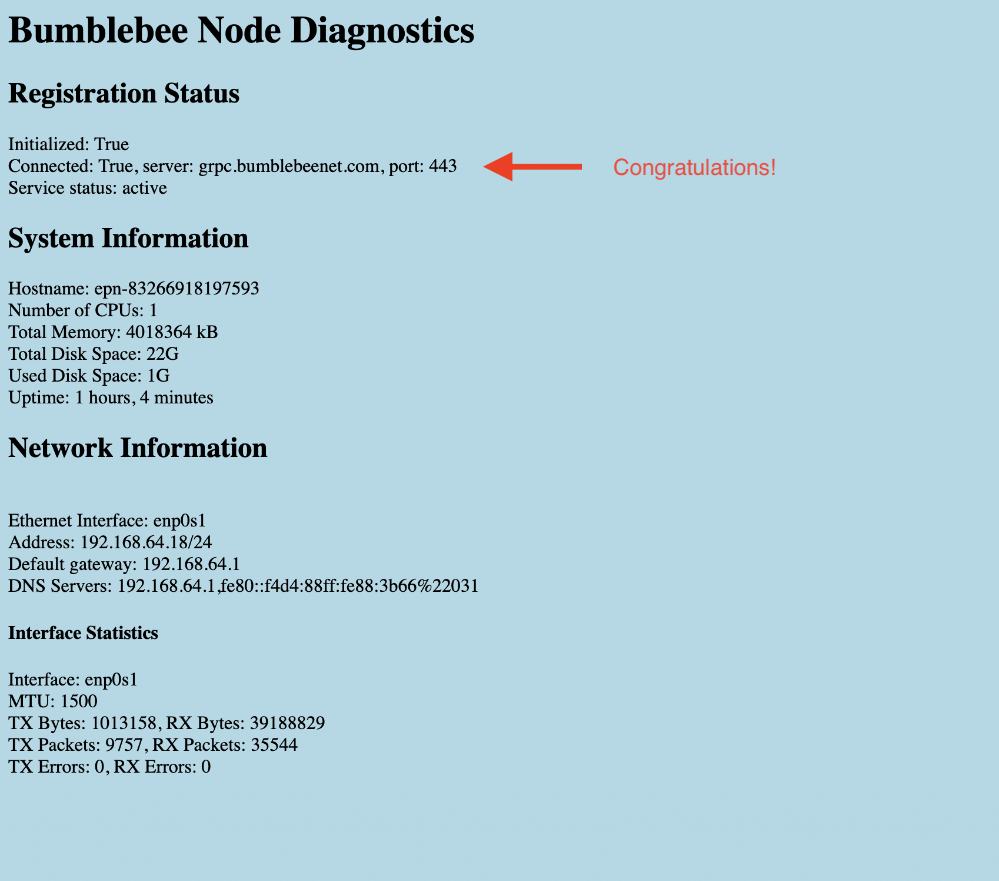

===========================
Troubleshoot Endpoint Node
===========================

Endpoint Nodes are virtual machines image or hardware devices deployed in on-premise location. 
They host Endpoints for remote networks to access applications on-prem. Once deployed, 
they registers with the Bumblebee Networks automatically. You should see them listed on 
Endpoint Nodes page in a "registered" admin state and "up" Op state. 

If you have trouble bringing them up, follow these steps to troubleshoot. 
For simplicity, only the name Node is used for the rest of the document. 

Step 1. Check DHCP 
===================================

A Node requires a DHCP environment where it obtains its primary IP address automatically. There is no work around if DHCP is not configured. 

You should find its IP address at the virtual machine console, it looks similar to the screen shot below. 
(Reserve the IP address once the node boots up.)

|primary_ip|

Step 2. Check *.bumblebeenet.com is reachable 
=================================================

The node needs to reach `*.bumblebeenet.com` on TCP port 443 and UDP ports 443
While the Node does not have a public IP address, it requires outbound access to *.bumblebeenet.com on 
both TCP port 443 and UDP ports range 443 

Once the Node obtained its IP address, go to http://node_primary_ip:8080 to view diagnostics. The diagnostics page shows if the connection to Bumblebee Networks is successful. If it is not, it shows what the problem is. 

|node_diag|

Step 3. Contact support
========================================

If you still help, contact support@bumblebeenet.com

