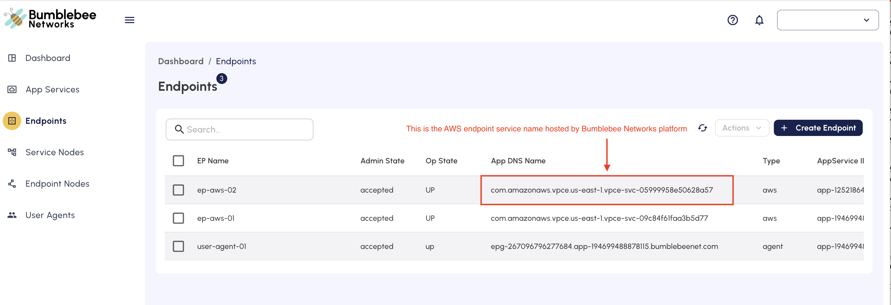
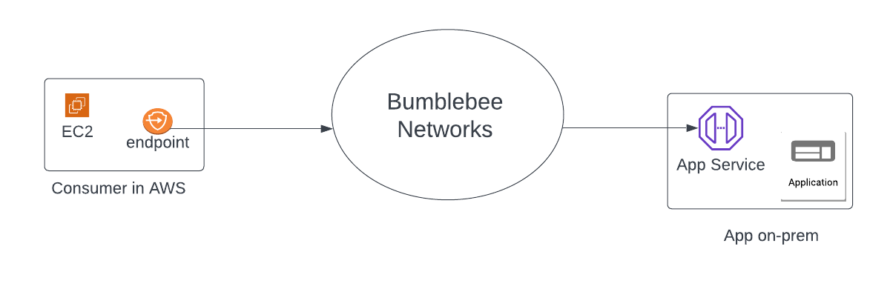

=======================================
Create Endpoint for consumer in AWS
=======================================

This document shows you how to create an Endpoint for consumer in AWS.

If you need to connect your AWS VPC to access an application on-prem, in AWS or Azure,  you can do so by creating an Endpoint in consumer VPC in AWS. 
An example use case is shown below where application is on-prem. 

|endpoint_aws_diagram|

In order to create an Endpoint on Bumblebee platform, you must already have the corresponding App Service ID provided from your service provider that you wish to connect to. 

Endpoint for Consumer in AWS Creation Steps
================================================

1. Log in to the platform console
#. At the left navigation bar, click Endpoints
#. Click + Create Endpoint
#. Enter the endpoint name
#. Enter the App Service ID you obtained from the App Service account owner.
#. Select Location AWS.
#. For AWS Region, select a region where the consumer AWS VPC resides. 
#. For Allowed Principal, enter the consumer account IAM user or IAM role that is used to send traffic to Bumblebee Networks. Examples are: 

 .. code-block:: res

    arn:aws:iam::123456789123:root
    arn:aws:iam::123456789123:user/iam-user-name
    arn:aws:iam::123456789123:role/iam-role-name

    where ``123456789123`` is the AWS account of the consumer VPC, you may have to create to create an IAM user or IAM role if you don't already have one. 
    (you can use the root privilege but it is not recommended.) 

#. Click Create. This could take a few minutes. 

Post Creation Steps
======================

1. Accept the request from Endpoint. 
---------------------------------------

After the Endpoint is created, wait for its Admin State to go to "pending". 
Your Endpoint will appear on your service provider side for approval. 
Wait for the service provider side to approve your request. Once it is approved, 
the Endpoint Admin State becomes "accepted". In the mean time, its Op State should become "up". 

2. Test connectivity. 
---------------------------

Once the Endpoint Op State is in "up" state, test reachability from the Endpoint to the application. Go to Bumblebee console Endpoints page, select the newly created Endpoint, click Actions -> Test Reachability. You should get a round trip delay time in mini-seconds between the Endpoint and the application, and an indication that the Endpoint is operational. 

3. Create an AWS endpoint. 
-----------------------------

The next step is to create an AWS endpoint in the consumer VPC. The corresponding AWS endpoint service (hosted by Bumblebee Networks platform) can be found on the list of Endpoint page on Bumblebee console, as shown below. 

|app_dns_name|

Copy the value of the field App DNS Name as shown above. The value is the AWS endpoint service hosted by Bumblebee Networks platform to 
receive packets and forward to the application you wish to connect. 

In your AWS console, create an AWS VPC endpoint in the consumer VPC for the endpoint service created by Bumblebee described above. 
Follow the instructions here if you need help to create the AWS endpoint. 
For service category in the instructions, choose "Other endpoint services". 

Once you have created AWS VPC endpoint in the consumer VPC, you can access the application by directing the traffic to the AWS VPC endpoint, 
the standard method for AWS private link. If the application runs on HTTPS, you 
need to setup a DNS alias record as described in the next step. 

4. Setup DNS alias for HTTPS applications. 
---------------------------------------------

If the application runs on HTTPS, the consumer (or API caller) must use the original application API 
endpoint to obtain server side TLS certificate for validation.  This application API endpoint DNS is 
different from the AWS endpoint DNS name created in the previous step 3. In order for the API caller 
seamlessly use the application API endpoint, you need to create an Route 53 private hosted zone that 
has the domain name of the application DNS. Then create an CNAME record for the application DNS name 
with the alias value of the AWS VPC endpoint. For more details, refer to Create VPC interface endpoint 
and private hosted zone. 

Troubleshooting Tips
======================

To troubleshoot connectivity issues from the endpoint, follow the instruction How to troubleshoot 
connectivity issue for endpoint.

