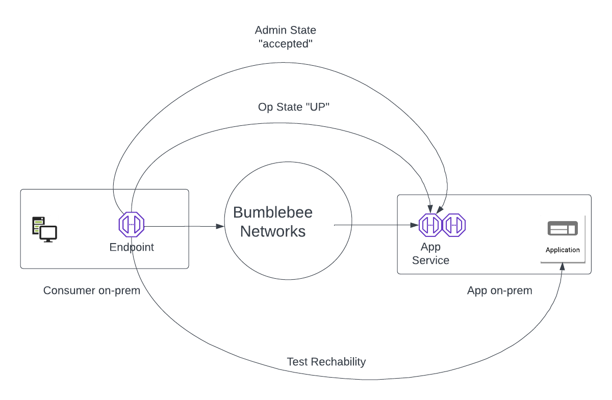

=========================
Troubleshoot Endpoint
=========================

This guide focuses on the reachability from Endpoint to the application self. 

|troubleshoot_endpoint|

Login to the console. 
Click Endpoints page on the navigation menu. 
Select the desired Endpoint and follow the steps below to troubleshoot its reachability.  

Step 1 Check Admin State
===========================

Make sure the Endpoint Admin Sate is in "accepted" state. 

If it is in "pending" state, remind the App Service owner to approve your request. 

Step 2. Check Op State
=========================

The Op State should be in "UP" state. 

- If Op State is "UP", it means the Endpoint has connectivity to the App Service. Proceed to the next step to find out what other places the issues lie. 
- If Op State is "DOWN", the Endpoint does not have connectivity to the App Service. Check Endpoint Node deployment requirements to make sure the Endpoint Node is in "registered" state, its TCP port 443 and UDP port 443 are open to *.bumblebeenet.com. Proceed to the next step for further information.

Step 3. Run Test Reachability
==================================

For the selected Endpoint, click Action -> Test Reachability

The Test Reachability runs a latency test between the Endpoint and the application itself. It reports minimum, average and maximum latency in mini-seconds between the two points. When there is connectivity issue, it also reports the problem and possible remedies.  

If Test Reachability returns latency numbers, the connectivity from the Endpoint to the actual application is good. If you have issue from host machine to reach the application, proceed to Step 4. 
If Test Reachability returns errors, following the suggestions from the return report to further troubleshoot. 

Step 4. Run Show Flows test
=================================

If the "Run Test Reachability" succeed but the host machine cannot access the application, the problem is with the last (or first) mile between the host machine and the endpoint. 
For the selected Endpoint, click Action -> Show Flows. 

The result shows a list of source IP addresses and source ports that have sent packets to the Endpoint. 
If you do not see the IP address of the problem host machine, the host machine has not been able to reach the Endpoint. Check if the host has the correct App DNS Name for the application, or there is any firewall rules blocking the traffic from host machine to the Endpoint. 

If all attempts fail, contact support@bumblebeenet.com for assistance. 

