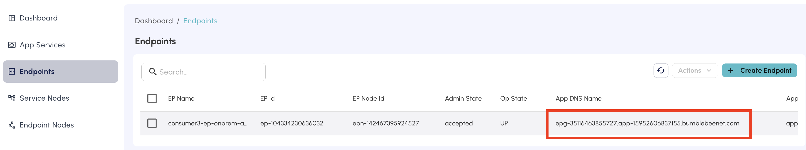
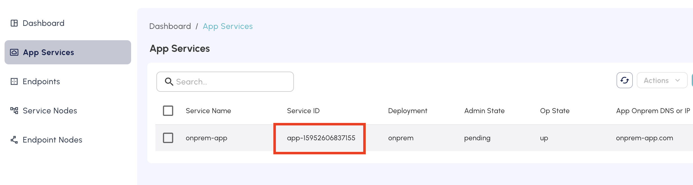

=================================================
Tutorial: Example of end-to-end configuration
=================================================

Welcome to Bumblebee Network platform!

In this tutorial, we'll show you how to setup an end-to-end configuration for connectivity between an on-prem App Service and on-prem Endpoint. The example is done with a single account where App Service and Endpoint shares the same account. For multiple accounts where App Service and Endpoints do not share the same account, the work flow is exactly the same. The workflow is also exactly the same if the App Service is in the cloud. 

Step 1. Create an App Service 
=================================

As a service provider for the application, follow the How to create an App Service for on-prem application instruction to create an App Service. 

Step 2. Take note of the App Service ID
===========================================

Copy the App Service ID once the App Service is created. Your application consumers need this ID to 
create Endpoints. 

|app_service_id|

Step 3. Create an Endpoint
=============================

As a consumer to the application, follow the How to create an Endpoint instruction to create an Endpoint. 
After the Endpoint is created, its Admin State is in "pending" state, waiting for the App Service to approve it. 

After Endpoint is created, a request should be sent to the App Service for approval. 

Step 4. Approve the Endpoint
=================================

In this step, we'll approve the request from the Endpoint. 

Click App Services at the navigation bar, select the app service created in this tutorial In the expansion panel, you should see the Endpoint request with its account information is pending for approval. Go ahead approve the Endpoint. 

Step 5. Take note of the App DNS Name
========================================

Once the Endpoint has been approved, the Endpoint page should show the Endpoint's Admin State changes to "accepted" state. Wait for the Endpoint's Op State become "UP". This may take up to 15 minutes as DNS propagates for the very fist Endpoint of a given App Service. 

Click Endpoints at the navigation bar, select the Endpoint created in this tutorial. Take a note of the App DNS Name.  From the Endpoint point of the view, this App DNS Name is the DNS name to reach the application. (While the App DNS Name is public, its resolution is a private IP address. If you run a dig command on this App DNS Name, you'll see it resolves to the Endpoint's private IP address)

|app_dns_name|

(Before you run connectivity test, make sure the Endpoint Op State is in "UP" state.)

Use this App DNS Name on any host machine in the on-prem where the Endpoint and Endpoint Node is deployed and test connectivity to the application. 

Step 6. Troubleshooting Tips
==========================================================

The key to troubleshoot is to first make sure the app service's Op State is up and pass the reachability test. Then make sure the endpoint's Op State is up and pass the reachability test. 

If both app service and endpoint pass reachability test, then the problem is the first mile, that is, between the on-prem host machine to the endpoint. You can use Show Source IP to find out if the on-prem host machine did send traffic to the endpoint. There maybe a firewall rule that blocks that the connectivity to the endpoint. Also check the DNS name used to resolve the application, it should resolve to the endpoint IP address. 

Step 7. (Optional) Customize the App DNS Name
=================================================

If you already have a local DNS name for the application and would like to continue using it, modify, 
in your local DNS server, the application DNS entry to a DNS CNAME record whose VALUE field is the 
App DNS Name. With this approach the connectivity becomes transparent to your users. 
They don't need to know the underlying solution has been changed to using Bumblebee Networks. 

    