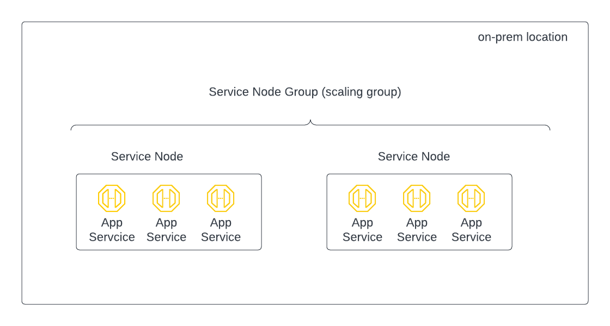

====================================================
Create Service Node and Service Node Group
====================================================

This document shows you how to create Service Node and Service Node Group. 

Similar to Endpoint Node, a Service Node is a virtual machine. It is deployed in on-prem location to 
host an App Service for an on-prem application. A Service Node can host multiple App Services for 
multiple applications. (If your application is in AWS, you do not need to create a service node.)

A Service Node Group is a scaling group. Service Nodes in the same Service Node Group form a cluster that allows higher throughput. 
When you add a Service Node in a Service Node Group, the new Service Node will automatically deploy all App Services in the Service Node Group. 

The relationship of App Service, App Service Node and App Service Node Group is illustrated in the diagram below. 

|service_node_group|

There are two workflows to create a Service Node. 
The first one is embedded in the `App Service Create process <https://bumblebee-networks-bumblebee-docs.readthedocs-hosted.com/en/latest/AppService/create_app_service_onprem.html>`_  
where you click New Group when the drop down menu for Service Node Group is 
empty or you need to create a new Service Node Group for a new location. 
The second workflow is from Service Nodes on the main navigation menu, 
this process is for adding a new Service Node to an existing Service Node Group or new Service Node Group.

In this guide, we show you the workflow from the Service Nodes page. 

To download an Service Node, login to Bumblebee Networks platform. 

1. Click Service Nodes on the main navigation menu, then click Create Service Node. 
#. For name, a name for the Service Node. 
#. For service node group, select Use Existing Group if you are adding a service node for scaling up performance, or select New Group to start a new service node group.
#. Click Create Service Node. 
#. Click Preparing for OVA for Download
#. Click Download OVA. 

Note the OVA is built to work with Intel based servers. Once the OVA is downloaded, 
deploy the OVA in the on-prem where the OVA can reach the On-prem application you intend to 
register with Bumblebee platform. For help deploying OVA, follow the instructions 
`here. <https://docs.vmware.com/en/VMware-vSphere/8.0/vsphere-esxi-host-client/GUID-FBEED81C-F9D9-4193-BDCC-CC4A60C20A4E_copy.html#:~:text=Right%2Dclick%20Host%20in%20the,name%20for%20the%20virtual%20machine>`_ 

