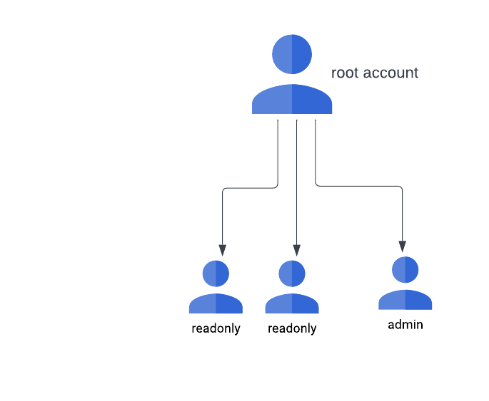

=======================================================================================================
Bumblebee platform IAM user management
=======================================================================================================

Bumblebee platform supports multiple users access to the platform under the same root account. 
Root account is the account created at the account sign up time. 

A root account can allow more users to access the account by adding IAM users. An IAM user is of two roles, admin and readonly. 

- Admin: an IAM user of admin role has read and write privileges on all functions except billing. 
- Readonly: an IAM user of readonly role has read privileges on all functions except billing. 

|iam_user|

Create an IAM user
===================

1. Login to Bumblebee portal as the root account user
#. Click IAM at the left navigation menu
#. Enter user name in the form of email
#. Select the user role: readonly or admin
#. Click Create

An email is sent to the IAM user to login. 

Delete an IAM user
===================

1. Login to Bumblebee portal as the root account user
#. Click IAM at the left navigation menu
#. Select the IAM user 
#. Click Actions -> Delete

